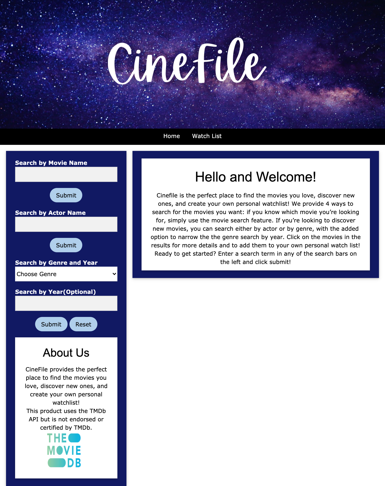
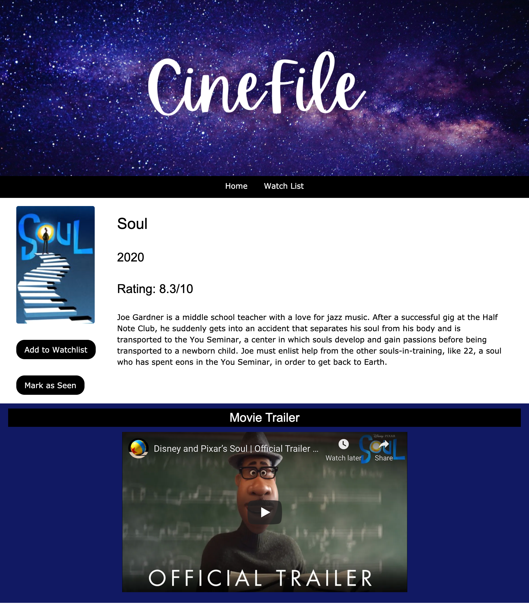
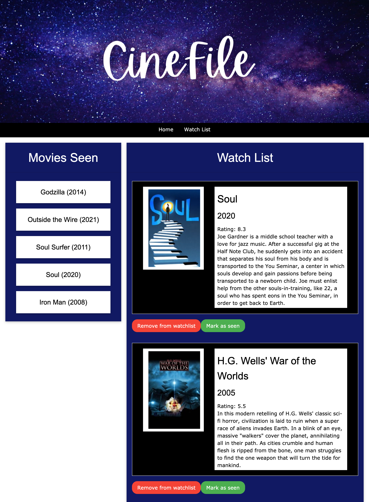

# CineFile
Personal movie database

User Story:

As a film enthusiast, I want to be able to find new movies to watch based 
on the movies I have seen and create a “watch List’ from my search

Project description: 

For this project, we created a multipage web application designed to help movie lovers search for and find the movies they wish to watch, the relevent details and trailer for the selected movies and the option to add selected movies to their own personal watchlist. To provide the search functionality, we made use of The Movie DataBase API and for the embedded Youtube trailer we made use of the IMDB API.

On navigating to the homepage, the user is presented with a series of input fields in the sidebar as well as a welcome message that gives a brief overview of how to use the application. Users can search by movie name, by actor name or by genre and/or year. When the user inputs a search term in their chosen input field and clicks the submit button, the welcome message disappears to be replaced by the search results. If no data is found for the search term, an error messasge will be displayed in the results section and users can try again. Users can reset the page at any time using the provided reset button.

On viewing the results, users are presented with the movie name, year of release, rating, brief synopsis and poster for each list item. Each list item is clickable and on clicking an item the user is redirected to a movie details page that displays details for the chosen movie as well as an embedded youtube trailer. The user can now either add the movie to their watchlist, mark it as seen, or navigate back to the search page from the navigation menu. 

When the user wishes to see their watchlist, they can navigate to the page from the link in the navigation menu. On the watchlist page the user will be presented with their watchlist with the option to mark each movie as seen or simply delete it from the watchlist if they so choose. All movies marked as seen will be visible in the sidebar of the watchlist page. The watchlist and seen movie list functionality is made possible with the use of local storage.

This was a group project, worked on by:
https://github.com/burtk33
https://github.com/nidaqg
https://github.com/flieckster

The github for the project can be found at:

https://github.com/burtk33/CineFile

The deployed project can be found at:

